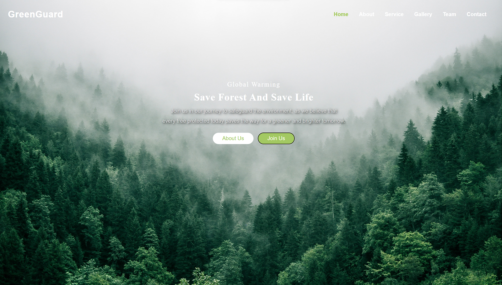
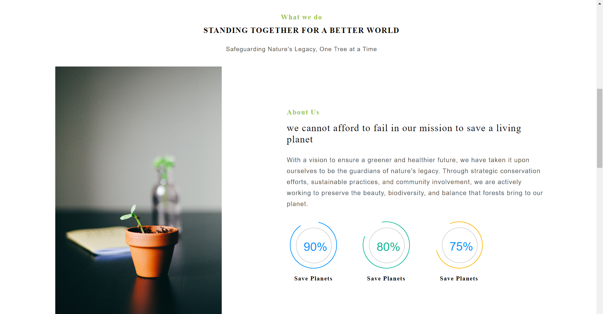
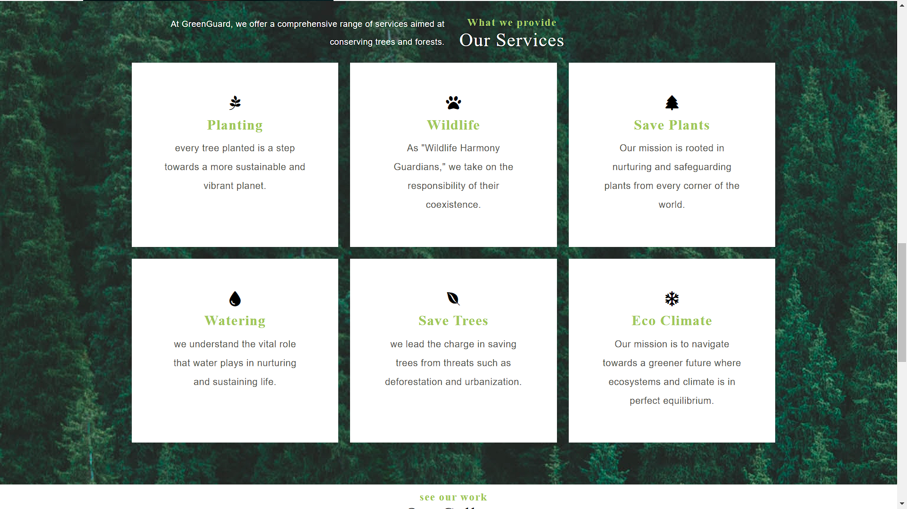
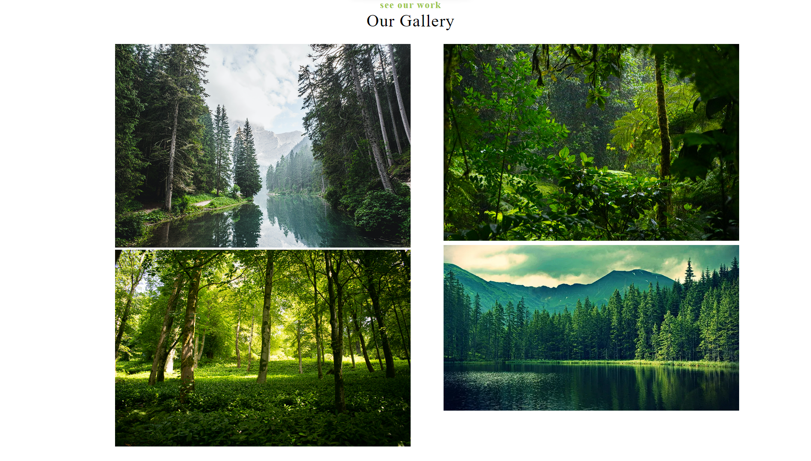
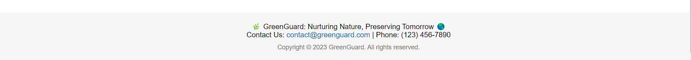

# CodSoft1
Landing Page Level 1 Task1
<b>Zomato Frontend Page</b>

Welcome to the GreenGuard Frontend Page! This repository contains the frontend code for the GreenGuard website
which is a public initiative towrds environment sustainability

<b>Demo Webpage Link:</b> https://deepbhapkar.github.io/CodSoft1/

<b>Technologies Used:</b>

The GreenGuard Page utilizes the following technologies:

<b>HTML</b>: Markup language for structuring the web pages.

<b>CSS</b>: Styling language for visually enhancing the UI.

Webpage looks like => 

